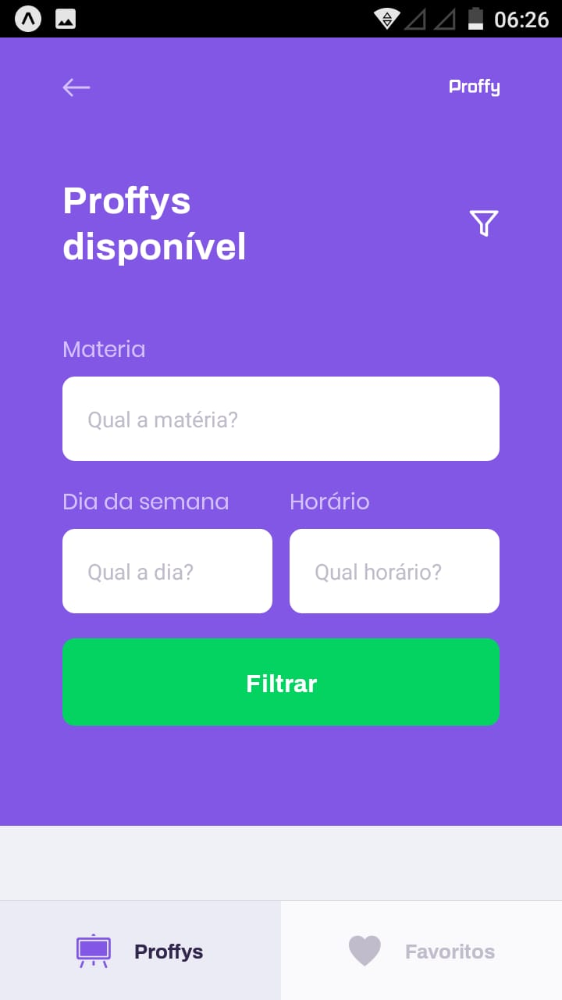

# Proffy

## Table of Contents

* [About the Project](#about-the-project)
  * [Built With](#computer-built-with)
* [Getting Started](#getting-started)
* [Meta](#meta)

---

<!-- ABOUT THE PROJECT -->
## About The Project

#### Project developed to connect teachers and students

<div>
  
  
  
  
</div>

---

## :computer: Built With

Main technologies used in the project

* Typescript 
* SQLite3
* React    
* Expo

---

<!-- GETTING STARTED -->
# Getting Started

```bash
# Clone Repository
$ git clone https://github.com/SuiciniVz/NLWProffy_mobile.git

# Install Dependencies
$ yarn install

# Run Aplication
$ yarn start
```
:eyes: Read the QR Code with the app of expo or run on emulator.

---

## Meta

Lucas Santos – [](https://www.linkedin.com/in/lucas-santos-4519aa1b0/) 
| 
[](mailto:lucasparaipaba113@gmail.com)

This project is under the [MIT license](./LICENSE).

[https://github.com/SuiciniVz/github-link](https://github.com/SuiciniVz)

